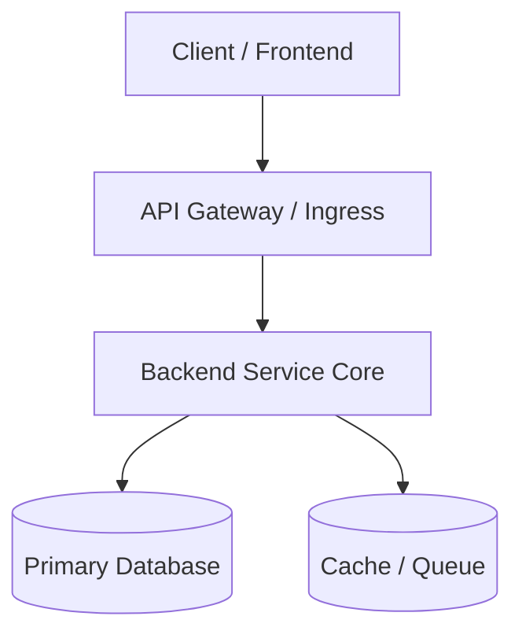

# 02 — System Architecture

**Pattern:** [Modular Monolith / Microservices / Event-Driven]
**Primary Stack:** [Languages, Frameworks, Runtimes]
**Data Stores:** [Relational, Caching, Document, Vector]

---

## 1. High-Level Component Topology

## 2. Architectural Boundaries & Invariants
- Invariant 1: [e.g., All mutations require database transactions]
- Invariant 2: [e.g., Domain logic is decoupled from HTTP handlers]
