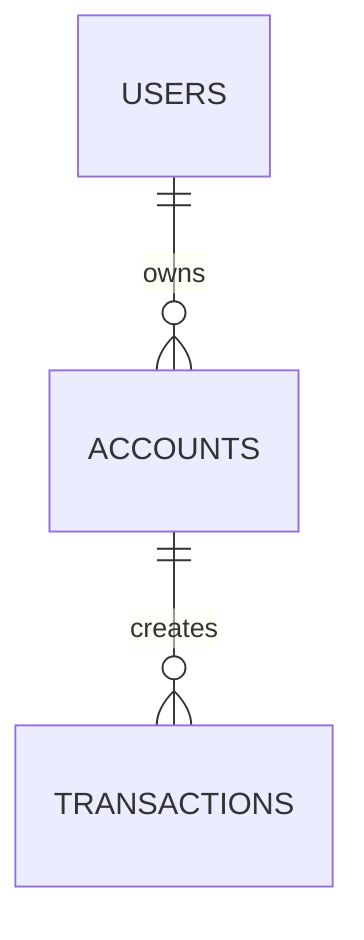

# 07 — Data Model Master & Schema Catalog

**Database Engine:** [PostgreSQL / MySQL / SQLite]
**Extensions Active:** [e.g., PostGIS, pg_trgm]

---

## 1. Entity Relationship Diagram

## 2. Database Migration Inventory
| Migration File | Tables Introduced / Modified | Rollback Available |
|---|---|:---:|
| `001_initial.sql` | `users`, `sessions` | Yes |
